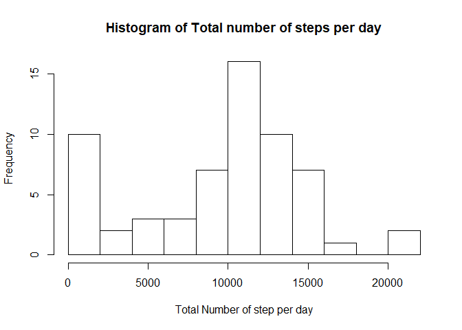
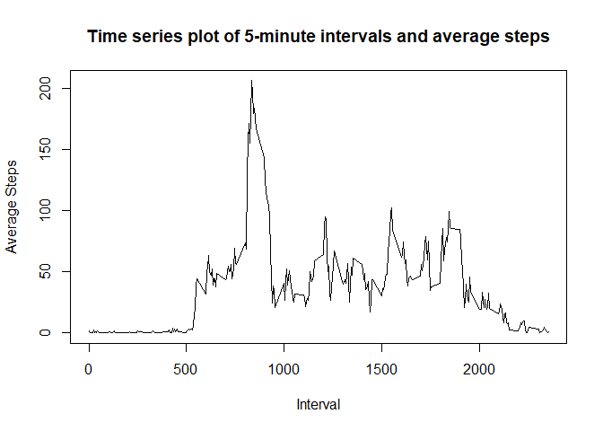
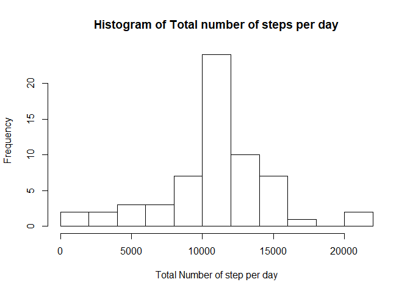
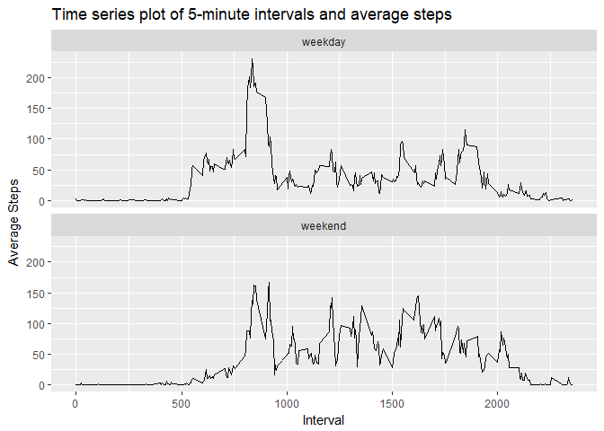

## Loading and preprocessing the data
Reading the activity.csv data and changing the date column as Date class

```r
activityData <- read.csv("activity.csv", colClasses = c("numeric","character", "numeric"))
activityData <- transform(activityData, date = as.Date(date))
```


## What is mean total number of steps taken per day?
Calculating the total number of steps per day by aggregating the steps column by the date (Ignoring NA values).

```r
stepsPerDay <- aggregate(activityData["steps"], 
                         by = list(date = activityData$date), 
                         FUN = sum, na.rm = TRUE)
```
Generating the histogram of total steps per day calculated above.

```r
hist(stepsPerDay$steps,
     breaks = 10,
     main = "Histogram of Total number of steps per day",
     xlab = "Total Number of step per day")
```

<!-- -->

Mean and Medain of the total steps per day.

```r
df1 <- data.frame(Mean = mean(stepsPerDay$steps), Median = median(stepsPerDay$steps))
df1
```

```
##      Mean Median
## 1 9354.23  10395
```
The mean of the total steps is 9354.2295082 and the median is 1.0395\times 10^{4}.

## What is the average daily activity pattern?
Calculating the average number of steps for each interval acorss all days (Ignoring NA values).

```r
aveStepsInterval <- aggregate(activityData["steps"], 
                              by = list(interval = activityData$interval), 
                              FUN = mean, na.rm = TRUE)
```
Creating a time series plot of the 5-minute interval and the average number of steps from the above aggregate. 

```r
plot(x = aveStepsInterval$interval,
     y = aveStepsInterval$steps,
     type = "l",
     xlab = "Interval",
     ylab = "Average Steps",
     main = "Time series plot of 5-minute intervals and average steps")
```

<!-- -->

The interval with the maximum number of steps found using which.max function.

```r
maxInterval <- aveStepsInterval[which.max(aveStepsInterval$steps),]$interval
maxValue <- aveStepsInterval[which.max(aveStepsInterval$steps),]$steps
```
The interval with the max value is 835 with a value of 206.1698113.
## Imputing missing values
Replaceing the NA values using the average steps per interval calculated above. Creating a copy of the data frame and matching the steps from the missing data to the average steps data.

```r
#Creating a copy of the Activity dataframe
updatedData <- data.frame(activityData)

#Getting the missing data to match from the average steps data frame
missingRows <- is.na(updatedData$steps)
missingData <- updatedData[missingRows,]
matchData <- match(missingData$interval, aveStepsInterval$interval)

updatedData[missingRows,"steps"] <- aveStepsInterval$steps[matchData]
```
Calculating the total number of steps per day after imputing/adding the missing data using interval averages.

```r
#Total number of steps per day after including average steps for missing data
updatedStepsPerDay <- aggregate(updatedData["steps"], 
                                by = list(date = updatedData$date), 
                                FUN = sum, na.rm = TRUE)
```
Generating the histogram of total steps per day calculated above.

```r
hist(updatedStepsPerDay$steps,
     breaks = 10,
     main = "Histogram of Total number of steps per day",
     xlab = "Total Number of step per day")
```

<!-- -->

Mean and Medain of the total steps per day.

```r
df2 <- data.frame(Mean = mean(updatedStepsPerDay$steps), Median = median(updatedStepsPerDay$steps))
df2
```

```
##       Mean   Median
## 1 10766.19 10766.19
```
Comparing the mean and median with the data without imputing NA values.

```r
compareData <- rbind(df1, df2)
compareData <- cbind(Type = c("Skipping NA", "Imputing NA"), compareData)
compareData
```

```
##          Type     Mean   Median
## 1 Skipping NA  9354.23 10395.00
## 2 Imputing NA 10766.19 10766.19
```
## Are there differences in activity patterns between weekdays and weekends?
Adding a column to represent whether it is a weekday or weekend.

```r
weekdaysList <- c('Monday', 'Tuesday', 'Wednesday', 'Thursday', 'Friday')
weekdaysData <- ifelse(weekdays(updatedData$date) %in% weekdaysList,
                       "weekday","weekend")
updatedData <- transform(updatedData, weekday = weekdaysData)
```
Averaging the data by interval and by weekday/weekend

```r
weekdayAveSteps <- aggregate(updatedData["steps"], 
                             by = list(interval = updatedData$interval,
                                       weekday = updatedData$weekday),
                             FUN = mean, na.rm = TRUE)
```
Plotting the timeseries plot of the 5-minute interval and the average number of steps, split by weekday/weekend.

```r
library(ggplot2)
ggplot(data = weekdayAveSteps, 
       aes(x = weekdayAveSteps$interval, 
           y = weekdayAveSteps$steps)) + 
    geom_line() + 
    labs(x = "Interval", 
         y = "Average Steps", 
         title = "Time series plot of 5-minute intervals and average steps") +
    facet_wrap(~weekday, ncol = 1)
```

<!-- -->
